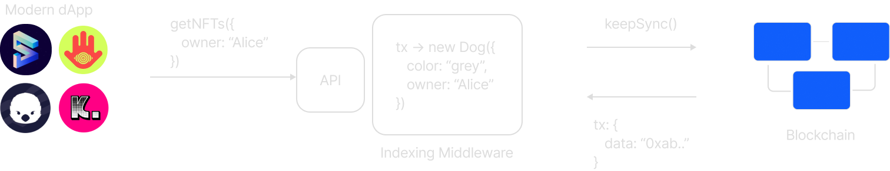
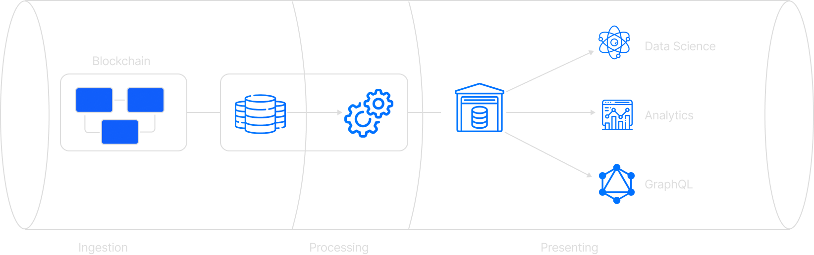

<!-- _backgroundImage: url(./bg.png) -->
<span class=title>

## One framework to index them all

</span>

<span class=subtitle>

### (Combine EVM and Substrate data with Subsquid)

</span>

### 
### 
### 
### 

---

# Greetings 👋

### Massimo Luraschi

### Developer Advocate @ subsquid.io

-  [@RaekwonIII](https://twitter.com/RaekwonIII) 
-  RaekwonIII#3962 
-  [@RaekwonTheChefIII](https://t.me/RaekwonTheChefIII) 
-  [RaekwonIII](https://github.com/RaekwonIII) 

---

<span class=subtitle>

### Indexing middleware

</span>



<span class=bulletpoint>

##### Ingest on-chain data
##### Data processing framework

</span>

---


<span class=subtitle>

### Why is middleware important

</span>

#### 📉 Minimize network requests
#### 📊 Minimize on-device storage
#### 💱 Seamlessly update 
#### ⛓️ Inherently multichain

---

<span class=subtitle>

### Modular Architecture

</span>



---

<span class=subtitle>

### Monolith

</span>

**Multiple uses, same ingestion**
**Potential replication**
**Wasted effort, resources**

<span class=subtitle>

### Modular

</span>

**Shared extraction services: Archives**

---
<span class=subtitle>

### Data flow

</span>


---
<span class=subtitle>

### Archives benefits

</span>

###### One less thing to **care about**
###### Better storage, **better performance**
###### **Filtering** batching
###### Reduced **network overhead**
###### Modularity ➡️ **future improvements**

---

<span class=subtitle>

### squids 🦑

</span>


---
<span class=subtitle>

### Subsquid SDK benefits

</span>

###### **Automated** model generation
###### Automated **ABI ➡️ code**
###### **Code** (TypeScript), not config
###### Strong typing/**type safety**
###### **Aquarium** - hosted service

---

<!-- _color: #105EFB -->
<span class="subtitle">

### From schema...
</span>

```graphql
type Owner @entity {
  id: ID!
  ownedTokens: [Token!]! @derivedFrom(field: "owner")
  balance: BigInt
}
```

---
<!-- _color: #105EFB -->

<span class="subtitle">

####
#### ...To Models
</span>

```typescript
@Entity_()
export class Owner {
  constructor(props?: Partial<Owner>) {
    Object.assign(this, props)
  }

  @PrimaryColumn_()
  id!: string

  @OneToMany_(() => Token, e => e.owner)
  ownedTokens!: Token[]

  @Column_("numeric", {transformer: marshal.bigintTransformer, nullable: true})
  balance!: bigint | undefined | null
}

```

---
<!-- _color: #105EFB -->

<span class="subtitle">

### From ABI...
</span>

```json
[
  // ...
  {
    "inputs": [
      { "internalType": "address", "name": "to", "type": "address" },
      { "internalType": "uint256", "name": "tokenId", "type": "uint256" }
    ],
    "name": "approve",
    "outputs": [],
    "stateMutability": "nonpayable",
    "type": "function"
  },
  // ...
]
```

---
<!-- _color: #105EFB -->

<span class="subtitle">

### …to TypeScript
</span>

```typescript
export const functions = {
    // ...
    approve: new Func<[to: string, tokenId: ethers.BigNumber], {to: string, tokenId: ethers.BigNumber}, []>(
        abi, '0x095ea7b3'
    ),
    // ...
}

const { _name } = functions.approve.decode(transaction.input);
```

---
<!-- _color: #105EFB -->

<span class="subtitle">

### Aquarium hosting service
</span>

```bash
npm i -g @subsquid/cli@latest
sqd deploy .
```

Visit [app.subsquid.io](https://app.subsquid.io/)

---
<!-- _color: #105EFB -->

<span class="subtitle">

### Resources

</span>

Docs [docs.subsquid.io](https://docs.subsquid.io)
GitHub [github.com/subsquid/](https://github.com/subsquid/)
YouTube [youtube.com/c/subsquid](https://www.youtube.com/channel/@subsquid)
Discord [discord.gg/subsquid](https://discord.gg/subsquid)
Telegram [t.me/HydraDevs](https://t.me/HydraDevs)
Medium [medium.com/subsquid](https://medium.com/subsquid)

---

<!-- .slide: data-background="https://i.imgur.com/4P35oA6.png" -->

<span class="subtitle">

# Let’s get coding…🦑

</span>


---

<!-- .slide: data-background="https://i.imgur.com/4P35oA6.png" -->

<span class="subtitle">

## Gromlin + GLMR tracker

</span>

1. Setup<!-- .element: class="fragment" -->
2. Review the schema<!-- .element: class="fragment" -->
3. Substrate types<!-- .element: class="fragment" -->
4. Contract ABI<!-- .element: class="fragment" -->
5. Edit logic in Processor<!-- .element: class="fragment" -->
6. Launch database container<!-- .element: class="fragment" -->
7. Create and apply database migration<!-- .element: class="fragment" -->
8. Launch processor and GraphQL server<!-- .element: class="fragment" -->

---

<!-- .slide: data-background="https://i.imgur.com/4P35oA6.png" -->

<!-- .slide: class="smol" -->
<!-- .slide: class="left" -->
<span class="subtitle">

# Setup

</span>

- Requisites: [Node.js](https://nodejs.org/en/download/) (16 or later), [Docker](https://docs.docker.com/get-docker/), [Subsquid CLI](https://docs.subsquid.io/squid-cli/)
- Create new project
- Install dependencies (plus new package for Frontier EVM)

```bash
sqd init encode-live
cd encode-live && npm i
```

select `frontier-evm` template

---

<!-- .slide: data-background="https://i.imgur.com/4P35oA6.png" -->

<!-- .slide: class="smol" -->
<!-- .slide: class="left" -->
<span class="subtitle">

# Schema

</span>

Defined in `schema.graphql` file. Already correct! 🎉
Only need to change `balance` to be mandatory

```graphql
type Owner @entity {
  id: ID!
  ownedTokens: [Token!]! @derivedFrom(field: "owner")
  balance: BigInt!
}
```

----

<!-- .slide: data-background="https://i.imgur.com/4P35oA6.png" -->

<!-- .slide: class="smol" -->
<!-- .slide: class="left" -->
<span class="subtitle">

# Codegen

</span>

- From project's root folder, launch `sqd codegen`
- Files will be re-generated


---

<!-- .slide: data-background="https://i.imgur.com/4P35oA6.png" -->

<!-- .slide: class="smol" -->
<!-- .slide: class="left" -->
<span class="subtitle">

# Substrate types

</span>

- Edit `typegen.json` 
- Edit `specVersions` ([Archive Registry repo](https://github.com/subsquid/archive-registry/blob/main/archives.json#L549))
- Specify `Balances.Transfer` in `events`
- Specify `Balances.Account` in `storage`

---

<!-- .slide: data-background="https://i.imgur.com/4P35oA6.png" -->

<!-- .slide: class="smol" -->
<!-- .slide: class="left" -->

<span class="subtitle">

# Substrate types

</span>

- Add a command to `commands.json` (convenience😝)

```bash
"typegen-substrate": {
    "description": "Generate data access classes for an substrate metadata",
    "cmd": ["squid-substrate-typegen", "./typegen.json"]
},
```
- From project root folder, launch:

```bash
sqd typegen-substrate
```

---

<!-- .slide: data-background="https://i.imgur.com/4P35oA6.png" -->

<!-- .slide: class="smol" -->
<!-- .slide: class="left" -->
<span class="subtitle">

# Contract ABI

</span>

- DPS contract [from moonscan](https://moonscan.io/token/0x224AcB257f1E95Fe310E1ab9BB402C579bC5eeAE) (or just ERC-721)
- In most cases, paste ABI into a JSON file (`dps.json`)
- run command `sqd typegen dps.json --multicall`

----

<!-- .slide: data-background="https://i.imgur.com/4P35oA6.png" -->

<!-- .slide: class="smol" -->
<!-- .slide: class="left" -->
<span class="subtitle">

# Contract handler

</span>

- Edit `src/contract.ts`
- Add import from ABI
- Edit contract address

```typescript
import { Contract as ContractAPI } from "./abi/erc721";

export const contractAddress = "0xf27a6c72398eb7e25543d19fda370b7083474735";
```

----

<!-- .slide: data-background="https://i.imgur.com/4P35oA6.png" -->

<!-- .slide: class="smol" -->
<!-- .slide: class="left" -->
<span class="subtitle">

# Contract handler

</span>

- Edit function to create a contract entity

```typescript
export async function createContractEntity(ctx: Context): Promise<Contract> {
  const lastBlock = ctx.blocks[ctx.blocks.length -1].header
  const contractAPI = new ContractAPI({...ctx, block: lastBlock}, contractAddress);
  let name = "", symbol = "", totalSupply = BigNumber.from(0);
  try {
    name = await contractAPI.name();
    symbol = await contractAPI.symbol();
    totalSupply = await contractAPI.totalSupply();
  } catch (error) {
    ctx.log.warn(`[API] Error while fetching Contract metadata for address ${contractAddress}`);
    if (error instanceof Error) {
      ctx.log.warn(`${error.message}`);
    }
  }
  return new Contract({
    id: contractAddress,
    name: name,
    symbol: symbol,
    totalSupply: totalSupply.toBigInt(),
  });
}
```

----

<!-- .slide: data-background="https://i.imgur.com/4P35oA6.png" -->

<!-- .slide: class="smol" -->
<!-- .slide: class="left" -->
<span class="subtitle">

# Contract handler

</span>

- Edit function to handle singleton instance

```typescript
let contractEntity: Contract | undefined;

export async function getContractEntity(ctx: Context): Promise<Contract> {
  if (contractEntity == null) {
    contractEntity = await ctx.store.get(Contract, contractAddress);
    if (contractEntity == null) {
      contractEntity = await createContractEntity(ctx);
      await ctx.store.insert(contractEntity);
    }
  }
  return contractEntity;
}
```

---

<!-- .slide: data-background="https://i.imgur.com/4P35oA6.png" -->

<!-- .slide: class="smol" -->
<!-- .slide: class="left" -->
<span class="subtitle">

# Processor 

</span>

- Change archive and chain endpoint

```typescript
const processor = new SubstrateBatchProcessor()
    .setDataSource({
        archive: lookupArchive('moonbeam', {type: "Substrate"}),
        chain: "wss://wss.api.moonbeam.network"
    })
// ...
```

---

<!-- .slide: data-background="https://i.imgur.com/4P35oA6.png" -->

<!-- .slide: class="smol" -->
<!-- .slide: class="left" -->
<span class="subtitle">

# Processor 

</span>

- Add data request for EVM logs

```typescript
const processor = new SubstrateBatchProcessor()
  // ...
  .addEvent('Balances.Transfer', {
    data: {
      event: {
        args: true,
        extrinsic: {
          hash: true,
          fee: true,
        },
      },
    },
  } as const)
// ...
```

---

<!-- .slide: data-background="https://i.imgur.com/4P35oA6.png" -->

<!-- .slide: class="smol" -->
<!-- .slide: class="left" -->
<span class="subtitle">

# Processor 

</span>

- Use Substrate types for Moonbeam to decode Event

```typescript
  for (const block of ctx.blocks) {
    for (const item of block.items) {
      if (item.name === "EVM.Log") {
        // ...
      }
      if (item.name === "Balances.Transfer") {
        let e = new BalancesTransferEvent(ctx, item.event);
        let balanceTransfer: { from: Uint8Array; to: Uint8Array; amount: bigint };
        if (e.isV900) {
          let [from, to, amount] = e.asV900;
          balanceTransfer = { from, to, amount };
        } else if (e.isV1201) {
            balanceTransfer = e.asV1201;
        }  else {
          throw new Error("Unsupported spec");
        }
      }
    }
  }
```

---

<!-- .slide: data-background="https://i.imgur.com/4P35oA6.png" -->

<!-- .slide: class="smol" -->
<!-- .slide: class="left" -->
<span class="subtitle">

# Processor 

</span>

- New data interface

```typescript
type BalanceData = {
  id: string;
  from: string;
  to: string;
  amount: bigint;
  timestamp: bigint;
  block: number;
  transactionHash: string;
};
```

---

<!-- .slide: data-background="https://i.imgur.com/4P35oA6.png" -->

<!-- .slide: class="smol" -->
<!-- .slide: class="left" -->
<span class="subtitle">

# Processor 

</span>

- New interface array + `saveTransfers` function arg

```typescript
processor.run(database, async (ctx) => {
  const transfersData: TransferData[] = [];
  const balancesData: BalanceData[] = [];
  // ...
  await saveTransfers(ctx, transfersData, balancesData);
});
```

---

<!-- .slide: data-background="https://i.imgur.com/4P35oA6.png" -->

<!-- .slide: class="smol" -->
<!-- .slide: class="left" -->
<span class="subtitle">

# Processor 

</span>

- Add decoded event info to array

```typescript
      if (item.name === "Balances.Transfer") {
        // ...
        const balance: BalanceData = {
          id: item.event.id,
          from: getAddress(toHex(balanceTransfer.from)),
          to: getAddress(toHex(balanceTransfer.to)),
          timestamp: BigInt(block.header.timestamp),
          amount: balanceTransfer.amount,
          block: block.header.height,
          transactionHash: item.event.extrinsic?.hash || "",
        };
        balancesData.push(balance);
      }
```

---

<!-- .slide: data-background="https://i.imgur.com/4P35oA6.png" -->

<!-- .slide: class="smol" -->
<!-- .slide: class="left" -->
<span class="subtitle">

# Processor 

</span>

- Add logic to update balance (rough and inaccurate 😅)

```typescript
  for (const balanceData of balancesData) {
    let from = owners.get(balanceData.from);
    if (from == null) {
      from = new Owner({ id: balanceData.from, balance: 0n });
      owners.set(from.id, from);
    }
    from.balance -= balanceData.amount
    let to = owners.get(balanceData.to);
    if (to == null) {
      to = new Owner({ id: balanceData.to, balance: 0n });
      owners.set(to.id, to);
    }
    to.balance += balanceData.amount
  }
```
---

<!-- .slide: data-background="https://i.imgur.com/4P35oA6.png" -->

<!-- .slide: class="smol" -->
<!-- .slide: class="left" -->
<span class="subtitle">

## Database

</span>

* A **squid** need a database to store processed data
* Templates have `docker-compose.yml` file to launch a container
* From project's root folder, launch  `sqd up`

---

<!-- .slide: data-background="https://i.imgur.com/4P35oA6.png" -->

<!-- .slide: class="smol" -->
<!-- .slide: class="left" -->

<span class="subtitle">

## Database migration

</span>

- Clean up existing migrations

```bash
sqd migration:clean
```

- Create new migration (will build code)

```bash
sqd migration
```

---

<!-- .slide: data-background="https://i.imgur.com/4P35oA6.png" -->

<!-- .slide: class="smol" -->
<!-- .slide: class="left" -->
<span class="subtitle">

## Launch the project

</span>

- Launch the Processor (will lock the console window)

```bash
sqd process
```

- Launch the GraphQL server (in another console window)

```bash
sqd serve
```

- Open the browser at http://localhost:4350/graphql

---

<!-- .slide: data-background="https://i.imgur.com/4P35oA6.png" -->
<span class="subtitle">

# Ta-da! 🎉

</span>


This project is available on [GitHub](https://github.com/RaekwonIII/encode-workshop)

---

<!-- .slide: data-background="https://i.imgur.com/4P35oA6.png" -->

<span class="subtitle">

# What's next?

</span>

### Pick a ~~card~~ contract, any ~~card~~ contract! 🃏🪄

Subsquid SDK allows extreme flexibility.

We ingest blocks, extract data, you decide how to process and index it.

---

<!-- .slide: data-background="https://i.imgur.com/4P35oA6.png" -->

<span class="subtitle">

# Thank you 🦑

</span>

Follow the project on GitHub
https://github.com/subsquid/squid


Give us a ⭐, more Alpha coming soon™️

---
<!-- _color: #105EFB -->

<span class="subtitle">

### Shameless plug

</span>

* Medium [medium.com/subsquid](https://medium.com/subsquid)
* YouTube [youtube.com/c/subsquid](https://www.youtube.com/channel/@subsquid)
* Docs [docs.subsquid.io](https://docs.subsquid.io)
* GitHub [github.com/subsquid/](https://github.com/subsquid/)
* Discord [discord.gg/subsquid](https://discord.gg/subsquid)
* Telegram [t.me/HydraDevs](https://t.me/HydraDevs)

----

<!-- .slide: data-background="https://i.imgur.com/4P35oA6.png" -->

<span class="subtitle">

# Bonus: storage access

</span>

 - Request Account balances from storage
 - Build map to associate account to its balance

```typescript
async function getAccountBalances(ctx: Context, ownersIds: Set<string>) {
  const storage = new BalancesAccountStorage(ctx, ctx.blocks[ctx.blocks.length -1].header);
  const ownerAddresses = [...ownersIds]
  const ownerUintArrays = ownerAddresses.map((x) => new Uint8Array(decodeHex(x)));
  const accountsData = await storage.asV900.getMany(ownerUintArrays);

  return new Map(ownerAddresses.map((v, i) => [v, accountsData[i].free]))
}
```

----

<!-- .slide: data-background="https://i.imgur.com/4P35oA6.png" -->

<span class="subtitle">

# Assign balance to accounts

</span>

```typescript
const accountsData = await getAccountBalances(ctx, ownersIds);
for (const transferData of transfersData) {
  // ...
    let from = owners.get(transferData.from);
    if (from == null) {
      from = new Owner({ id: transferData.from, balance: 0n });
      owners.set(from.id, from);
    }
    from.balance = accountsData.get(from.id) || 0n
  // ...
}
```

----

<!-- .slide: data-background="https://i.imgur.com/4P35oA6.png" -->

<span class="subtitle">

# Multicall

</span>

Search `Multicall` on [moonscan](https://moonscan.io/address/0x6477204e12a7236b9619385ea453f370ad897bb2)

```typescript
  const maxHeight = Math.max(...transfersData.map(o => o.block)); 
  // query the multicall contract at the max height of the chunk
  const multicall = new Multicall(ctx, {height: maxHeight}, MULTICALL_CONTRACT)
  ctx.log.info(`Calling mutlicall for ${transfersData.length} tokens...`)
  // call in pages of size 100
  const results = await multicall.tryAggregate(erc721.functions.tokenURI, transfersData.map(t => [contractAddress, [t.token]] as [string, any[]]), 100);
  results.forEach((res: any, i: number) => {
      let t = tokens.get(transfersData[i].token.toString());
      if (t) {
          let uri = '';
          if (res.success) {
              uri = <string>res.value;
          } else if (res.returnData) {
              uri = <string>erc721.functions.tokenURI.tryDecodeResult(res.returnData) || '';
          }
          t.uri = uri;
      }
  });
  ctx.log.info(`Done`);
```